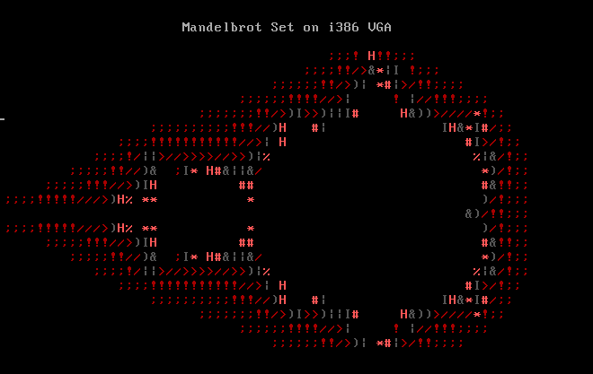

# fractal geometry 

```
i. 	mandelbrot 
ii. 	julia
iii. 	i386_mandelbrot 
```

```sh
building:

$ gcc mandelbrot.c -lm
$ gcc julia.c -lm
$ cd i386_mandelbrot & make & make qemu
```

Mandelbrot Set as i386 freestanding binary:

